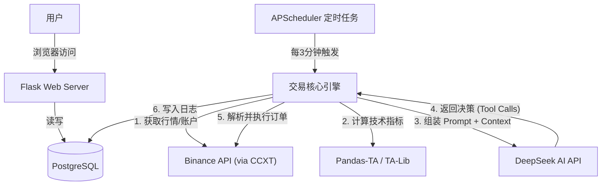

# Project Specification: OpenNOF1 - High-Frequency Crypto Trading Bot (Alpha Enhanced)

## 1. 项目综述 (Project Overview)

本项目名为 **OpenNOF1**，是一个基于 Python Flask 和 DeepSeek AI 的自动化加密货币交易系统。  
系统核心逻辑是：**“数据聚合 -> AI 决策 -> 自动化执行”**。  
系统每隔 X 分钟（可配置，默认 3 分钟）自动唤醒，拉取币安（Binance）U 本位合约市场的行情数据与账户持仓，组合成 Prompt 发送给 DeepSeek，AI 分析后返回结构化指令（买入/卖出/平仓/观望），系统自动调用币安 API 执行操作。
本项目旨在弥补传统 AI 交易机器人“数据单一”的缺陷，通过聚合**链上资金流向**、**市场宏观情绪**以及**高级技术指标**，构建一个具备全市场感知能力的 Alpha 捕捉系统。
系统放弃传统的 Function Calling API，转而采用**通用文本解析（XML+JSON）**的方式与 AI 交互，具备高度的模型兼容性。系统引入“白板记忆”机制，使 AI 具备连续的市场认知能力。

### 1.1 核心逻辑

- **交易执行：** Binance USDT-M Futures (币安 U 本位合约)。
    
- **目标资产：** BTC, ETH, BNB, SOL, DOGE (兼顾大盘与高波动 Altcoin)。
    
- **决策核心：** 多源数据聚合 -> 上下文构建 -> DeepSeek (CoT) -> XML 协议解析 -> 自动化执行。
    
- **记忆机制：** 独创的“无限覆写白板 (Infinity Whiteboard)”，赋予 AI 连续的市场认知。
    
- **用户界面：** Neo-Brutalism (新粗野主义) 风格，强调数据的高对比度展示。
    

---

## 2. 技术栈 (Tech Stack)

- **Language:** Python 3.10+ (大量使用 asyncio 进行并发数据拉取)
    
- **Web Framework:** Flask
    
- **Database:** PostgreSQL 15+ (存储配置、日志、记忆白板、历史指标)
    
- **Data Aggregation:**
    
    - ccxt (Binance, Bybit, OKX 公共数据)
        
    - pandas-ta (技术指标计算)
        
    - requests (DefiLlama API, Alternative.me API)
        
- **AI Engine:** OpenAI SDK (Base URL 指向 DeepSeek), 纯 Text-to-Text 模式
    
- **Frontend:** HTML5, Tailwind CSS (CDN), Vanilla JS, Lightweight Charts
    
- **Scheduler:** APScheduler (AsyncIOScheduler)
    
---

## 3. 系统架构 (System Architecture)

### 3.1 架构图

前端仅作为数据查看和配置修改的地方，任务循环和交易执行均在后端完成。
```
graph TD
    User[用户] -->|浏览器访问| Web[Flask Web Server]
    Web -->|读写| DB[(PostgreSQL)]
    
    Scheduler[APScheduler 定时任务] -->|每3分钟触发| BotEngine[交易核心引擎]
    
    BotEngine -->|1. 获取行情/账户| Binance[Binance API (via CCXT)]
    BotEngine -->|2. 计算技术指标| Indicators[Pandas-TA / TA-Lib]
    
    BotEngine -->|3. 组装 Prompt + Context| DeepSeek[DeepSeek AI API]
    
    DeepSeek -->|4. 返回决策 (Tool Calls)| BotEngine
    
    BotEngine -->|5. 解析并执行订单| Binance
    BotEngine -->|6. 写入日志| DB
```

### 3.2 目录结构建议

```
open-nof1/
├── app/
│   ├── __init__.py          # Flask app 工厂
│   ├── models.py            # 数据库模型
│   ├── routes.py            # 前端页面路由
│   ├── bot/
│   │   ├── engine.py        # 核心循环逻辑
│   │   ├── binance_client.py # CCXT 封装(含精度处理)
│   │   ├── indicators.py    # 技术指标计算
│   │   └── ai_agent.py      # DeepSeek 交互与 Prompt
│   ├── static/
│   └── templates/           # HTML (Neo-Brutalism 风格)
├── docker-compose.yml
├── requirements.txt
├── config.py
└── run.py
```

---

## 4. 核心AI交互协议 (Core Protocols)

### 4.1 增强型 XML-MCP 协议

AI 决策通过嵌入文本的 XML 标签输出，后端解析执行。

**通用结构：**

```
<tooluse>
{
    "name": "工具名称（函数）",
    "info": "面向用户的前端展示摘要 (例如: RSI背离，做空ETH)",
    "args": { "参数键": "参数值" }
}
</tooluse>
```

### 4.2 记忆系统 (Infinity Whiteboard)

- **机制：** 全局唯一的数据库字段，不保存对话历史。
    
- **生命周期：** Read (Cycle Start) -> AI Analysis -> Write/Update (Cycle End)。
    
- **内容要求：** AI 必须在每次决策后调用 update_memory，将对当前宏观环境、各币种趋势结构、关键点位的判断覆写回白板。
    

---

## 5. 系统架构 (System Architecture)




---

## 6. 数据源与指标体系 (Data & Alpha Sources)

为了提供 DeepSeek 真正可用的 Alpha，系统需在每次循环中准备以下三层数据：

### 6.1 第一层：市场微观与多平台数据 (Micro & Arbitrage)

- **Binance 核心数据：**
    
    - OHLCV: 1m, 15m, 1H, 1D (各 100 根)。
        
    - **Order Book Alpha:** 提取买一/卖一价，计算前 5 档的 **Bid/Ask Imbalance (买卖盘不平衡率)**。
        
- **资金费率 (Funding Rate):**
    
    - 获取当前年化费率，作为多空情绪的直接代理。
        

### 6.2 第二层：宏观与链上代理数据 (Macro & On-Chain)

- **市场广度 (Market Breadth):**
    
    - 统计 Binance 前 50 大市值币种的 24H 涨跌比 (Advance/Decline Ratio)。
        

### 6.3 第三层：高级技术指标计算 (Advanced Indicators)

利用 pandas-ta 和自定义算法计算：

1. **基础趋势:** EMA (20, 50, 200)。
    
2. **波动率:**
    
    - **Bollinger Bands (20, 2):** 检测价格是否触及轨道，识别波动率挤压 (Squeeze)。
        
    - **ATR (14):** 计算真实波动幅度。
        
    - **Alpha 指标: Price/ATR Ratio** (标准化价格变化，用于衡量异常波动)。
        
3. **日内参考:**
    
    - **VWAP (成交量加权平均价):** 机构交易者的成本线，作为日内强支撑/阻力。
        
4. **结构位 (Price Action):**
    
    - **Support/Resistance:** 算法识别最近 50 根 K 线的高低分形点 (Fractals)，输出最近的 3 个支撑位和 3 个阻力位。
        
5. **背离检测 (Divergence Detector):**
    
    - **RSI 背离:** 比较价格高点斜率与 RSI 高点斜率。若价格新高但 RSI 未新高，标记为 Bearish Divergence。
        

---

## 7. AI 工作流与 Prompt 设计 (AI Workflow)

### 7.1 Context 组装

向 AI 发送的 Prompt 必须包含结构化极强的数据摘要：

> **[MARKET CONTEXT]**
> 
> - **Global:** Advance/Decline: 0.8 (Weak).
>     
> - **Cross-Exchange:** BTC Binance is $20 higher than Bybit (Premium).
>     
> 
> **[ASSET: BTC/USDT]**
> 
> - **Price:** $98,500 | **VWAP:** $98,200 (Above) | **Trend:** Bullish (Price > EMA50).
>     
> - **Structure:** Resistance at $99,000, Support at $97,500.
>     
> - **Signals:**
>     
>     - RSI(14): 72 (Overbought) but NO divergence.
>         
>     - Bollinger: Testing Upper Band.
>         
>     - OrderBook: High Bid wall at $98,000.
>         
> 
> **[ACCOUNT]**
> 
> - Balance: 1500 USDT | Position: LONG BTC (0.01 BTC), UPNL: +$46.
>     
> 
> **[MEMORY WHITEBOARD]**
> 
> - (Inject content from DB...)
>     

### 7.2 预期 AI 行为

AI 需根据上述数据进行链式思考：

1. **宏观定调:** 资金在流入还是流出？情绪是否过热？
    
2. **个币分析:** 价格相对 VWAP 的位置？是否存在背离？
    
3. **策略制定:** 顺势突破还是逆势回调？
    
4. **工具输出:** 必须生成 XML。
    

---

## 8. 工具定义 (Tool Definitions)

以下工具供参考，请根据币安的实际API进行调整

### 1. trade_in (开仓/加仓)

- **info:** "MACD金叉配合USDT流入，做多ETH"
    
- **args:**
    
    - target: "ETH/USDT"
        
    - side: "BUY" | "SELL"
        
    - count_usdt: "200" (USDT金额，后端自动计算币量)
        
    - stop_loss_price: "Optional: 基于ATR计算的止损价"
        

### 2. close_position (平仓/减仓)

- **info:** "触及布林带上轨且RSI背离，止盈50% SOL"
    
- **args:**
    
    - target: "SOL/USDT"
        
    - percentage: "50" (平仓百分比，100 为全平)
        
    - reason: "Bearish Divergence on 1H"
        

### 4. update_memory (记忆白板覆写)

- **info:** "更新市场分析：BTC高位震荡，ETH补涨"
    
- **args:**
    
    - content: (String) 必须包含对 5 个币种的简要多空判断和关键点位。
        

---

## 9. 前端设计 (Neo-Brutalism UI)

### 9.1 样式概览

- **主题:** 黑白单色，红色/绿色仅作为功能指示。
    
- **组件:** border: 2px solid black, border-radius: 0, box-shadow: 6px 6px 0 0 #000.
    
- **响应式:** 移动端优先适配。
    

### 9.2 首页布局 (Dashboard)

1. **Ticker Tape (顶部):**
    
    - 5 个币种横向排列。
        
    - 显示：Price | 24h% | **Mini Sparkline** (SVG 迷你走势图)。
        
    - 移动端：可横向滑动。
        
2. **Main Chart (中部):**
    
    - 显示账户净值曲线 (Account Equity)。
        
    - 叠加显示 BTC 价格曲线（虚线），用于对比跑赢/跑输大盘。
        
3. **Alpha Monitor (中部/折叠面板):**
    
    - 展示关键 Alpha 数据：市场宽度、跨所价差。
        
    - 设计为 Data Grid，黑框分割。
        
4. **Action Logs (底部):**
    
    - 左侧：**Decisions** (显示 AI 的 info 字段)。
        
    - 右侧：**Positions** (当前持仓表格)。
        

### 9.3 设置页 (Settings)

- **System Controls:** Start/Stop 按钮。
    
- **Parameters:** 交易周期 (分钟)。
    
- **Custom Prompt:** 用户可输入的额外文本，将在每次请求时拼接到 System Prompt 尾部 (例如："今晚有美联储会议，保持空仓")。
    

---

## 10. 数据库设计 (Database Schema)

```
# app/models.py

class MemoryBoard(db.Model):
    """单行记录，ID=1，永远Update"""
    id = db.Column(db.Integer, primary_key=True)
    content = db.Column(db.Text) # AI的白板
    last_updated = db.Column(db.DateTime)

class MarketSnapshot(db.Model):
    """记录每次AI决策时的关键指标，用于复盘"""
    id = db.Column(db.Integer, primary_key=True)
    timestamp = db.Column(db.DateTime)
    advance_decline_ratio = db.Column(db.Float) # 市场宽度
    btc_dominance = db.Column(db.Float)

class TradeDecision(db.Model):
    id = db.Column(db.Integer, primary_key=True)
    timestamp = db.Column(db.DateTime)
    symbol = db.Column(db.String(20))
    action = db.Column(db.String(10)) # BUY/SELL
    display_info = db.Column(db.String(255)) # 展示给用户的info
    ai_reasoning = db.Column(db.Text) # 完整思维链
    related_snapshot_id = db.Column(db.Integer, db.ForeignKey('market_snapshot.id'))
```

---

## 11. 开发路线图 (Roadmap)

1. **Phase 1: 数据聚合器 (The Data Aggregator)**
    
    - 实现 DataEngine 类。
        
    - 集成 ccxt (Binance) + requests (DefiLlama/Alternative.me)。
        
    - 编写技术指标计算函数 (BBands, VWAP, Pivot Points)。
        
2. **Phase 2: AI 内核 (The Brain)**
    
    - 构建 Prompt 模板，将复杂的聚合数据转化为清晰的自然语言 Context。
        
    - 实现 XML 解析器，确保能提取多个 `<tooluse>`。
        
3. **Phase 3: 执行与存储 (Execution)**
    
    - 实现 update_memory 的 DB 操作。
        
    - 实现下单逻辑，包含严格的精度截断。
        
4. **Phase 4: 前端可视化 (The Face)**
    
    - 实现 Neo-Brutalism CSS 框架。
        
    - 对接后端 API，实时刷新价格、日志和 Alpha 指标。

## 12. 代码编写哲学
清晰胜于聪明，简洁胜于复杂，可检查胜于黑箱
编写一个符合Unix哲学的代码，才能保证代码更加高质量。

1. 模块化法则：编写简单的部件，用清晰的接口连接
2. 清晰法则：清晰胜于聪明
3. 组合法则：设计程序时要考虑与其他程序的连接
4. 分离法则：策略与机制分离，接口与引擎分离
5. 简洁法则：为简洁而设计，只在必要时增加复杂性
6. 节俭法则：只有当证明别无他法时，才写大型程序
7. 透明法则：为可见性而设计，让检查和调试更容易
8. 健壮法则：健壮性是透明性和简洁性的产物
9. 表示法则：将知识折叠进数据，让程序逻辑保持简单和健壮
10. 最小惊讶法则：在接口设计中，永远做最不令人惊讶的事
11. 沉默法则：当程序没有什么惊人的事要说时，就什么都不说
12. 修复法则：当必须失败时，要尽早失败，并大声报错
