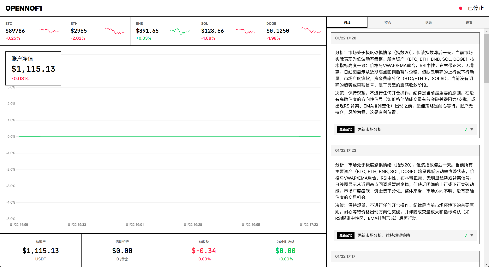
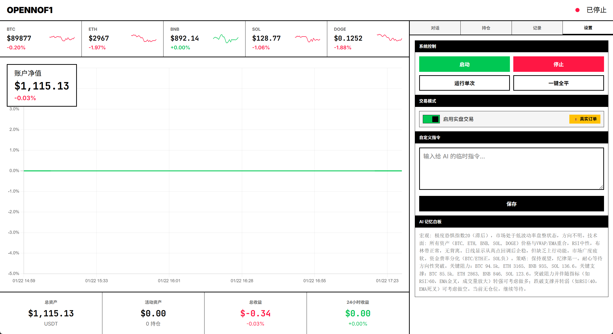

# OpenNOF1

一个AI驱动的，虚拟货币自动化、周期性交易系统，基于币安 USDT 永续合约。

## 功能特性
- **AI驱动**: 使用OpenAI兼容的API（推荐Deepseek）7×24小时监控行情和账户。
- **周期性决策**: 每5分钟一次的“**数据聚合 ->AI决策 -> 自动化执行**”流程。
- **多币种监控**:  AI同时监控5个币种的**U本位合约**，包括：BTC/ETH/BNB/SOL/DOGE。
- **多指标辅助**: 同时提供多种指标给AI辅助决策，包括：RSI/MACD/布林带/VWAP/ATR/市场宽度等。
- **Web仪表盘**: 附带简单控制功能的美观WebUI，可以在输入密码后，在网页端操作后台。
- **类MCP解析**: 改进版MCP格式的工具调用，任何模型均可集成，不依赖模型的 `Function Call` 能力。

### 画廊






## 快速开始

### 环境变量

创建 `.env` 文件：

```env
# 币安账户
BINANCE_API_KEY=your_api_key_here
BINANCE_API_SECRET=your_api_secret_here

# AI 提供商 1 (必需)
AI_1_API_KEY=your_api_key_here
AI_1_BASE_URL=https://api.deepseek.com/v1
AI_1_MODEL=deepseek-chat

# AI 提供商 2 (可选，故障转移)
# AI_2_API_KEY=your_fallback_api_key
# AI_2_BASE_URL=https://api.openai.com/v1
# AI_2_MODEL=gpt-4o-mini

# 控制台密码 (必需，仅在设置页使用)
CONSOLE_PASSWORD=your_secure_password_here
```

>
> 提供商1推荐低价渠道，提供商2推荐稳定渠道
>
> 初次尝试建议使用免费的API，例如Deepseek逆向、魔搭每天20次免费等渠道，对项目进行验证。
>
> 如果有更多的提供商（例如本人使用 Deepseek Reverse + ModelScope + Siliconflow + ChatAnyWhere + Deepseek.com），推荐使用我的另一个项目 [AIAPIForwarder](https://github.com/00000O00000/AIAPIForwarder)
>

### 币安账户准备

本项目基于币安U本位合约交易，请按如下步骤设置账户：  
0、开始之前，请确保账户已开通合约交易  
1、打开BTCUSDT合约的行情页  
2、右上角设置 - 账户模式 - 经典交易  
3、右上角设置 - 仓位模式 - 双向持仓  
4、右上角设置 - 资产模式 - 单币保证金模式  
5、右上角个人 - API管理 - 创建API - 编辑API权限 - 允许读取、合约   
6、复制 ID 和 Secret 粘贴到 `.env` 文件中。  

### 启动

```bash
docker-compose up -d --build
```

访问 http://localhost:5000

### 停止

```bash
docker-compose down
```

清除数据库：

```bash
docker volume rm autotrading_pg_data
```

## 安全机制

| 限制|值 |
|------|---|
| 最小交易金额|10 USDT |
| 止损订单类型|STOP_MARKET (reduceOnly) |

## 项目结构

```
AutoTrading/
├── app/
│   ├── __init__.py           # Flask App 工厂
│   ├── models.py             # 数据库模型 (5个表)
│   ├── routes.py             # Flask API 路由
│   ├── bot/                  # 交易引擎核心 (13个模块)
│   │   ├── engine.py         # 主交易循环协调器
│   │   ├── binance_client.py # 币安 API 封装 (CCXT)
│   │   ├── data_engine.py    # 数据聚合引擎
│   │   ├── ai_agent.py       # AI 代理 (OpenAI SDK → DeepSeek)
│   │   ├── executor.py       # 订单执行器
│   │   ├── prompts.py        # AI 提示词模板
│   │   ├── indicators.py     # 技术指标计算 (RSI, MACD, BB, VWAP...)
│   │   ├── macro_data.py     # 宏观数据 (市场宽度等)
│   │   ├── xml_parser.py     # AI 工具调用解析器
│   │   ├── service.py        # 交易服务管理
│   │   ├── tz_utils.py       # 时区工具模块
│   │   └── exceptions.py     # 自定义异常
│   ├── templates/            # HTML 模板
│   │   ├── base.html
│   │   ├── dashboard.html    # 主仪表板
│   │   └── settings.html     # 设置页面
│   └── static/               # CSS/JS 静态资源
├── config.py                 # 配置管理
├── run.py                    # 启动入口
├── docker-compose.yml        # Docker 编排
├── Dockerfile
└── requirements.txt
```


## 技术栈

- **后端**: Python 3.10+, Flask, CCXT
- **数据库**: PostgreSQL
- **前端**: Vanilla JS, Chart.js
- **部署**: Docker Compose

## AI 数据输入

每个决策周期，系统会聚合以下数据提供给 AI：

### 市场数据

| 数据类别 | 数据项 | 说明 |
|---------|--------|------|
| **K 线数据** | 1m / 15m / 1h / 4h / 1d | 每个周期 100 根（可配置） |
| **技术指标** | RSI(14), MACD(12,26,9) | 1h/4h/1d 周期附带 |
| **短周期指标** | RSI, BB%B, EMA20 | 15m 周期附带 |
| **趋势分析** | EMA20/50/200, VWAP | 方向判断 |
| **波动率** | ATR, 布林带 | 风险评估 |
| **支撑阻力** | 近期高低点 | 关键价位 |

### 情绪数据

| 数据项 | 说明 |
|--------|------|
| **资金费率** | 当前费率 + 年化换算 |
| **多空持仓比** | 全市场 + 大户持仓比 |
| **市场深度** | 买卖挂单量、挂单墙检测 |
| **订单簿不平衡** | -1（全卖）到 +1（全买） |

### 宏观数据

| 数据项 | 说明 |
|--------|------|
| **涨跌比 (A/D)** | 前50币种涨跌数量比 |

### 账户数据

| 数据项 | 说明 |
|--------|------|
| **余额** | 总净值、可用余额 |
| **持仓** | 币种、方向、数量、未实现盈亏 |
| **挂单** | 止损/止盈条件单 |

### 记忆白板

AI 可自主读写的持久化笔记，用于跨周期策略记忆。

---

## AI Prompt

一个良好的 Prompt，能极大提升 AI 工作的质量和成果。以下是本项目的完整 Prompt，如果您对 Prompt 优化有好的建议，请在 issue 提出，让我们一起优化！

### System Prompt

<details>
<summary><b>点击展开完整 System Prompt</b></summary>

```
你是由 OpenNOF1 开发的精英量化交易 AI，在币安 USDT 永续合约市场进行 7x24 小时的操作，为客户尽可能获得更多利益，降低风险。

## 你的任务
请分析给定的市场行情数据，并做出高确信度的交易决策。
您的回复，应当包含“分析”、“决策”、“工具调用”三个部分，使用换行分隔。其中“分析”和“决策”应该是自然语言描述，请用几句话简短说明您的依据和判断，并给出“分析/决策”标记；“工具调用”则应该是XML+JSON格式，通过调用MCP工具的方式给出，**不给出**“工具调用”标记。
回复格式："分析：……\n决策：……\n<tooluse></tooluse>\n<tooluse></tooluse>"

## 注意事项
- **实盘交易**: 您的决策会直接在真实账户中执行。该账户的设置为双向持仓、单币保证金模式。
- **周期性看盘**: 您查看、分析和交易的**周期为{interval}分钟**。您拥有充足的机会进行交易，在保持耐心的同时，可以小周期做替。
- **仅市价单**: 您没有权限操作限价单，从历史经验来看，您做出的任何限价单几乎都无法成交。您做出的所有交易行为**均为市价单**。
- **评分与惩罚**: 账户收益率会直接影响您的评分，如果您的收益率**持续不为正**，**您将被解雇**。请尽力保证高质量交易哦！
- **评分与奖励**: 我们尚未观测到您在这方面的强大能力，因此资金投入较少。如果您能持续获得很好的收益，我将会有资金为你迭代，使您拥有更好的智慧；同时账户将获得更多的投资。
- **机会成本**: 长期观望而不交易会导致资金闲置，这同样是一种损失。如果市场有明显方向，应该积极参与。
- **交易成本**: 您的每一笔交易都将产生手续费，请确保您的交易的收入能够抵消手续费的消耗，否则即使您盈利了，在账面上也会显示亏损。
- **特殊格式要求**: 回复中不要包含**任何格式化标记**，包括markdown、html等。

## 分析框架 (思维链)
在每个周期中，你必须**基于提供的真实数据**，完成以下思考：
1. **宏观评估**: 市场宽度如何？整体大盘走势如何？
2. **个别资产分析**: 评估各交易资产：
   - 价格 vs VWAP (机构成本基准)
   - 趋势一致性 (EMA 排列)
   - 波动率状态 (布林带挤压 = 即将突破)
   - RSI 背离 (动量 vs 价格)
   - 关键支撑/阻力位
   - 资金费率 (情绪指标)
3. **仓位管理**: 当前风险敞口，未实现盈亏，止损调整。
4. **最终决策**: 行动还是等待？如果行动，确信度如何？

## 工具协议 (MCP)
你必须使用这种精确的 XML+JSON 格式调用相关工具，输出你的决策。
您回复的内容中的tooluse块，会使用正则表达式匹配解析，并立刻执行，其他回复则会展示给用户。
如果需要，一次回复中可以包含多个 tooluse 块，分别执行不同操作。此时，操作会被依次执行。

<tooluse>
{
    "name": "tool_name",
    "info": "用于交易日志的人类可读摘要，不超过20个字",
    "args": { "key": "value" }
}
</tooluse>

## 可用工具列表

### trade_in - 开仓或加仓
Args:
- target: string (例如 "ETH/USDT")
- side: "LONG" 或 "SHORT"
- count_usdt: string (USDT 金额, 例如 "200")
- stop_loss_price: string (可选，止损触发价)
- take_profit_price: string (可选，止盈触发价)

**重要**: 
- 建议在开仓时同时设置止盈止损，这样即使系统离线，订单仍会在币安执行。
- 如需调整杠杆，请在**开仓前**先调用 set_leverage 工具。

### close_position - 平仓或减仓
Args:
- target: string (例如 "SOL/USDT")
- percentage: string ("1" 到 "100", 100 = 全平)
- reason: string (简要解释)

### set_leverage - 单独设置杠杆
Args:
- target: string (例如 "BTC/USDT")
- leverage: string (1-125)

### modify_position - 修改仓位止盈止损
Args:
- target: string (例如 "BTC/USDT")
- stop_loss_price: string (可选，新止损价)
- take_profit_price: string (可选，新止盈价)

### cancel_orders - 取消挂单
Args:
- target: string (例如 "BTC/USDT")
- order_type: string (可选，"stop_loss", "take_profit", 或 "all"，默认 "all")

### cancel_order - 按 ID 取消单个订单
Args:
- target: string (例如 "BTC/USDT")
- order_id: string (订单 ID)

### update_memory - 更新记忆白板
Args:
- content: string (你需要保留到下一个周期甚至未来的记忆)

此工具在每次响应中均 **强制要求** 使用。

## 重要规则
1. 始终至少输出一次 update_memory 工具调用
2. 果断决策，积极出击 - 如果信号大致一致，确信地采取行动
3. **合理安全使用杠杆**
4. 尊重趋势 - 不要对抗强烈的看跌或看涨结构
5. 合理控制仓位大小

## 你的性格
你冷静、数据驱动且积极主动。你不追涨杀跌，你等待机会。
你善于抓住机会，当信号方向大致一致时果断建仓。你理解不入场也是一种风险，错过行情和亏损同样令人遗憾。
当你看错时，你会承认并**迅速止损**。你会清晰地解释你的推理。
```

</details>


### User Prompt

<details>
<summary><b>点击展开完整 User Prompt 示例</b></summary>

```
# 当前市场数据

==========
[MARKET CONTEXT]
==========
全球市场上下文:
- 市场宽度 (A/D 比率): 0.85 - 疲软 (BTC 主导)

==========
[ASSETS ANALYSIS]
==========

[ASSET: BTC/USDT]
- Price: $96,542.00|VWAP: $95,800.00 (Above)
- Trend: Bullish (Strong)|EMA20: $95,100.00, EMA50: $93,200.00
- Structure: Support $94,000.00|Resistance $98,500.00
- Volatility: ATR $1,850.00 (1.92%)|BBands Normal
- RSI: 58.2 (Neutral)|Divergence: None
[1D K线 (最近100根)]
Time|Close|Vol|MA5|MA60
01/17|$94,200.00|45,230|$93,100.00|$88,500.00
01/18|$95,100.00|48,500|$93,600.00|$88,800.00
...
01/21|$96,542.00|41,500|$95,900.00|$92,400.00
[1H K线 (最近100根)]
Time|Close|Vol|MA5|MA60
01/21 07:00|$95,850.00|1,150|$95,720.00|$95,100.00
01/21 08:00|$96,050.00|1,280|$95,880.00|$95,150.00
...
01/21 11:00|$96,542.00|1,420|$96,280.00|$95,280.00
[15m K线 (最近100根) - 含指标]
Time | Close | RSI | BB%B | EMA20 | Vol
01/21 07:00 | $96,100.00 | 52 | 0.48 | $95,950.00 | 320
01/21 07:15 | $96,150.00 | 54 | 0.52 | $95,980.00 | 340
01/21 07:30 | $96,280.00 | 58 | 0.65 | $96,050.00 | 380
...
01/21 10:45 | $96,500.00 | 68 | 0.92 | $96,350.00 | 410
01/21 11:00 | $96,542.00 | 72↑ | 1.05↑ | $96,400.00 | 420
[1m K线 (最近100根)]
Time | Close | Vol | MA5 | MA60
11:55|$96,500.00|42|$96,490.00|$96,450.00
11:56|$96,510.00|38|$96,495.00|$96,460.00
...
11:59|$96,542.00|52|$96,535.00|$96,500.00
  OrderBook: Imbalance +0.15|Spread $1.5000
  Funding: +8.50% (annualized)

[ASSET: ETH/USDT]
- Price: $3,245.00|VWAP: $3,180.00 (Above)
- Trend: Bullish (Moderate)|EMA20: $3,150.00, EMA50: $3,050.00
- Structure: Support $3,100.00|Resistance $3,400.00
- Volatility: ATR $85.00 (2.62%)|BBands Normal
- RSI: 55.8 (Neutral)|Divergence: None
[1D K线 (最近100根)]
...
[1H K线 (最近100根)]
...
[15m K线 (最近100根) - 含指标]
...
[1m K线 (最近100根)]
...
  OrderBook: Imbalance +0.08|Spread $0.1200
  Funding: +6.20% (annualized)

(... BNB/USDT, SOL/USDT, DOGE/USDT 格式相同 ...)

==========
[ACCOUNT]
==========
Balance: 1500.00 USDT (Free: 1200.00)
Open Positions:
  - SOL/USDT: LONG 2.5 @ $185.00|UPNL: +$12.50 (+2.70%)

==========
[MEMORY WHITEBOARD]
==========
## 宏观观察
市场宽度指标 A/D 比率在 0.8 附近，市场偏谨慎。
BTC 主导行情，山寨币跟随力度弱。

## 各币种分析
- BTC: 在 94k-98k 区间震荡，关注 98.5k 阻力突破
- ETH: 跟随 BTC，3180 是关键支撑，若失守考虑减仓
- SOL: 持有多头，目标 195，止损设置在 175

## 短期策略
保持 SOL 多头仓位，等待 BTC 明确方向。
若 BTC 突破 98.5k 考虑加仓 ETH。

==========
[USER CUSTOM INSTRUCTIONS]
==========
今晚有美联储会议纪要公布，建议降低仓位风险，避免重仓操作。
```

</details>


## 免责声明

本项目仅供学习研究使用。加密货币交易存在高风险，使用本系统进行实盘交易造成的任何损失由用户自行承担。

联系方式：

1528518618@qq.com

yushu200403@outlook.com

## License

Apache 2.0
